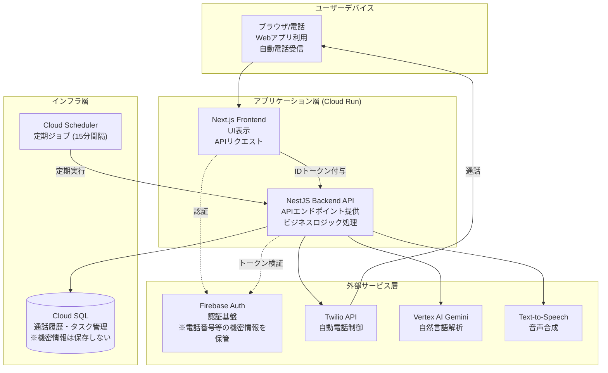

# voice-routine

todo-call は、電話を利用してタスク管理を自動化するサービスです。
このプロジェクトは、電話による自動通話を活用して、ユーザーが口頭で「今日やるべきこと」を確認・抽出できる仕組みを提供します。電話がかかってくるという体験は、単なるプッシュ通知以上にユーザーに対して心理的なコミットメントを促す効果があると考えられ、日々のタスク管理の負担を軽減する一助となることを期待しています。

---

## 特徴

- **自動通話によるタスク管理**
  - **朝の通話**
    ユーザーに「今日やるタスク」を口頭で尋ね、Vertex AI Gemini による自然言語解析で発話内容からタスクを抽出します。これにより、手入力の手間を省き、口頭で予定を伝えるだけでタスクが自動的に整理されます。
  - **夕方の通話**
    朝に抽出されたタスクの進捗状況を再確認し、完了したタスクの状態を自動で更新します。

- **音声応答と自動電話発信**
  - **Text-to-Speech** を活用して生成したテキストを、できるだけ自然な音声に変換し、ユーザーにフィードバックします。
  - **Twilio API** により、自動電話発信および通話状態の管理を行います。

- **セキュアな認証とデータ管理**
  ユーザーの電話番号などの機密情報は、Cloud SQL などのデータベースに保存することなく、**Firebase Authentication** により一元管理しています。これにより、個人情報の漏洩リスクを大幅に低減しています。

- **定期実行トリガーによる自動化**
  **Cloud Scheduler** を利用して、15分間隔でバックエンドのエンドポイントを呼び出す仕組みが実装済みです。設定されたタイミングで自動的に通話が発信され、タスク確認が確実に行われます。

---

## システムアーキテクチャ

以下の Mermaid 図は、システム全体の構成と各コンポーネント間の連携を示しています。ユーザーデバイスから Next.js フロントエンド、NestJS バックエンド、Google Cloud インフラおよび外部サービスとの連携まで、全体の流れを視覚的に把握できるようにまとめています。



図のポイント
	•	ユーザーデバイス (Client)
ユーザーは、ブラウザや電話から Web アプリにアクセスし、自動通話を受信します。
	•	Next.js Frontend (Apps 層)
Cloud Run 上にホストされた Next.js アプリが、UI 表示および認証管理（Firebase Auth を利用）を担当し、取得した ID トークンを付与して NestJS バックエンドに API リクエストを送信します。
	•	NestJS Backend API (Apps 層)
同じ Cloud Run 上で動作する NestJS バックエンドは、API エンドポイントを提供し、ビジネスロジック処理や外部サービス連携（Twilio、Vertex AI Gemini、Text-to-Speech）を実施します。内部では Firebase Auth によるトークン検証を行い、Cloud SQL を通じたタスクや通話履歴の管理も行います。
	•	Cloud SQL (Infra 層)
タスクや通話履歴などの情報は Cloud SQL で管理されますが、電話番号などの機密情報は保存しない設計です。
	•	Cloud Scheduler (Infra 層)
定期ジョブにより 15 分間隔でバックエンドのエンドポイントを呼び出し、自動通話発信をトリガーする仕組みが実装されています。
	•	外部サービス (External 層)
Firebase Auth が認証基盤として機能し、Twilio API が自動電話の発信および通話状態の管理、Vertex AI Gemini が自然言語解析、Text-to-Speech が音声合成をそれぞれ担当します。

## Installation & Running

### Prerequisites
	•	Bun (v1.2.1 以降) がインストールされていること
	•	Docker と Docker Compose がインストールされていること

### Installing Dependencies
リポジトリのルートディレクトリで以下のコマンドを実行して、依存関係をインストールします。

```
bun install
```

### Running the Project with Bun

#### Backend (NestJS)
1.	バックエンドの起動
通常は以下のコマンドで起動します。

```
bun run index.ts
```

または、開発モードで起動する場合は以下のコマンドを利用してください。

```
bun run start:dev
```


#### Frontend (Next.js)
1.	フロントエンドの起動
開発モードで起動するには、以下のコマンドを実行します。

```
bun run dev
```

#### ngrok を使った Twilio Webhook 設定
1. ngrok の起動
以下のコマンドで、ローカルサーバー（例：ポート 8080）を外部にフォワーディングします。

```
ngrok http 8080
```

2. 転送先 URL の設定
ngrok が発行する URL（例：https://xxxx.ngrok.io）を .env ファイルに設定してください。

```
TWILIO_WEBHOOK_URL=https://xxxx.ngrok.io
```


3.	Webhook テスト
下記の curl コマンドで、電話発信リクエストのテストが可能です。

```
curl -X POST http://localhost:8080/calls/initiate \
  -H "Content-Type: application/json" \
  -d '{"to": "+81XXXXXXXXXX", "type": "CREATED"}'
```

